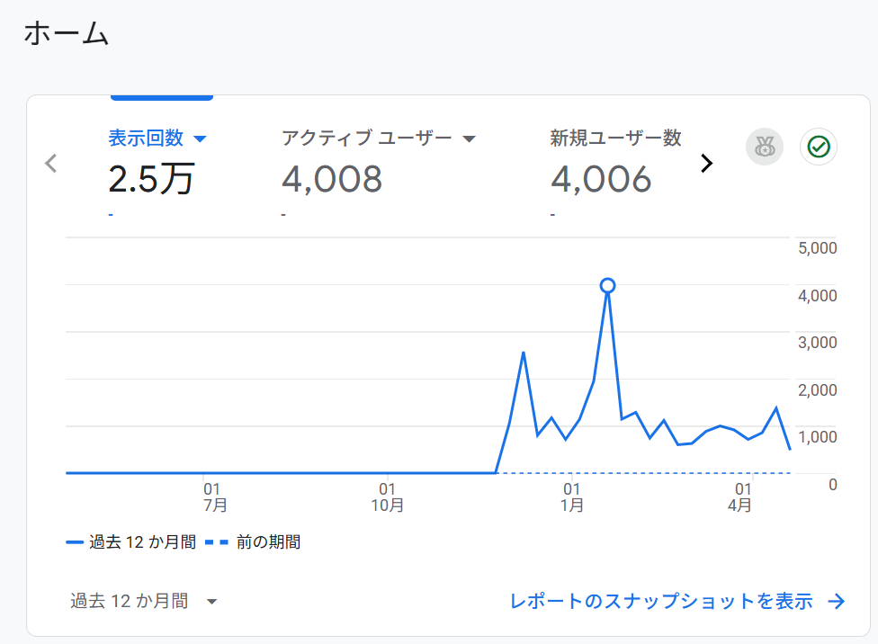

## 個人開発、してますか？

- 個人開発は男のロマン！

---

## 個人開発の悩み

- 作っても誰にも使われない問題
- そもそも誰にも見られない。知られない

---

## なら集客から始めよう！

- とりあえず自己紹介サイトを作ってみることに

---

## 私の自己紹介サイトを React, Vite, Vercel で作成！

- 普通のポートフォリオサイトでは面白くないので、ドラクエ風に！
- サイト →https://my-dq-portfolio.vercel.app/
- GitHub→https://github.com/developerhost/my-dq-portfolio
  - 現在 19 スター獲得！
- Zenn にて技術記事を公開！

その結果...

---

## 現在、累計 2.5 万 PV, 4000 ユーザー獲得！



↑

ここ拍手！

---

## 工夫した箇所

- RSS を用いて毎日更新された記事を取得

- src/rss/rss-parser.mjs

```js
import { writeFileSync } from "fs";

import Parser from "rss-parser";
const parser = new Parser();

(async () => {
  const rssFeed = {
    zenn: {
      label: "Zenn",
      url: "https://zenn.dev/dirtyman/feed",
      favicon: "https://zenn.dev/images/logo-transparent.png",
    },
    qiita: {
      label: "Qiita",
      url: "https://qiita.com/app_js/feed",
      favicon:
        "https://cdn.qiita.com/assets/favicons/public/production-c620d3e403342b1022967ba5e3db1aaa.ico",
    },
    note: {
      label: "Note",
      url: "https://note.com/dall_develop/rss",
      favicon:
        "https://assets.st-note.com/poc-image/manual/note-common-images/production/svg/production.ico",
    },
  };

  const allArticles = [];

  for (const [site, info] of Object.entries(rssFeed)) {
    try {
      const feed = await parser.parseURL(info.url);
      const articles = feed.items.map((item) => ({
        title: item.title || "",
        url: item.link || "",
        date: item.isoDate || "",
        thumbnail: item.enclosure?.url || "",
        favicon: info.favicon,
        site,
      }));
      allArticles.push(...articles);
    } catch (error) {
      console.error(`Error fetching feed for ${site}:`, error.message);
    }
  }

  writeFileSync("src/rss/data.json", JSON.stringify(allArticles, null, 2));
})();
```

- 使用ライブラリ
  - "rss-parser": "^3.13.0",

---

## react-simple-typewriter を用いてドラクエ風のチャット UI を実現！

- src/components/ChatMessage.tsx

```tsx
import { Typewriter } from "react-simple-typewriter";

interface ChatMessageProps {
  message: string;
  typeSpeed?: number;
}

export const ChatMessage = ({ message, typeSpeed = 50 }: ChatMessageProps) => {
  return (
    <div className="z-20" style={{ whiteSpace: "pre-line" }}>
      <Typewriter
        cursor
        cursorStyle="_"
        delaySpeed={1000}
        key={message}
        typeSpeed={typeSpeed}
        words={[message]}
      />
    </div>
  );
};

export default ChatMessage;
```

---

## その他工夫した点

- map を 2 重配列で持たせ、主人公が動き、話しかける動作を実現！
- md でブログを書ける機能を実装
  - "zenn-content-css": "^0.1.158",
  - "zenn-embed-elements": "^0.1.158",
  - "zenn-markdown-html": "^0.1.158"
- ドラクエ風の UI は以下のライブラリなどを使用
  - "react-use": "^17.5.1",
  - "tailwind-merge": "^2.5.5",
  - "tailwindcss-animate": "^1.0.7",

---

## 集客がある程度出来たので、現在作りたかったサービスを開発中！

リリースしたらみんな、インストールして使ってみてね！

---

## ご清聴ありがとうございました！

- 話しかけてもらえると喜びます！
- また、現在一緒に expo, React Native で個人開発してくれる方を大募集中！
- X→@dall_develop まで！
